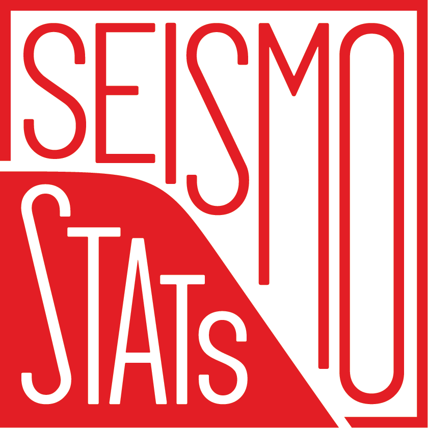

<h1 align="center">



<hr \>


[](https://pypi.org/project/seismostats/)
[](https://pypi.org/project/seismostats/)
[](https://github.com/swiss-seismological-service/SeismoStats/actions/workflows/tests.yml)
[](https://codecov.io/github/swiss-seismological-service/SeismoStats)
[](https://seismostats.readthedocs.io/en/latest/?badge=latest)

</h1>

Measure your seismicity with **SeismoStats**, a Python package for seismicity analysis.

>[!IMPORTANT]  
>We are actively working on a first stable version of `SeismoStats`. The API is not final yet and will still change until the first release coming in the next months. We are happy to receive feedback and suggestions for improvement.

## Start using `SeismoStats`:

This is intended for people interested in using existing functionalities and functions in `SeismoStats`, for example if you want to calculate an Mc, a-value and b-value for your catalogue and plot the frequency magnitude distribution.

```
pip install seismostats
```

That's all, you can now use SeismoStats!

## Installation from source

To get the very latest version of SeismoStats, you can install it directly from the source code. This is especially useful if you want to contribute to the development of SeismoStats.

After cloning, you can install SeismoStats by running the following command in the root directory of the repository:
```
pip install .
```
Or in development mode, including the development dependencies.
```
pip install -e '.[dev]'
```
To run the tests.
```
tox
```

## Citing
We are actively working on a publication to submit with the first stable version of `SeismoStats`. If you use the code for scientific work, and until a pre-print is available, please cite `SeismoStats` as:

Mirwald, A., Schmid, N., Han, M., Rohnacher, A., Mizrahi, L., Ritz, V. A., & Wiemer, S. (2025). SeismoStats: A Python Package for Statistical Seismology. https://github.com/swiss-seismological-service/SeismoStats

```
@misc{Mirwald2025,
   author = {Aron Mirwald and Nicolas Schmid and Marta Han and Alicia Rohnacher and Leila Mizrahi and Vanille A. Ritz and Stefan Wiemer},
   title = {SeismoStats: A Python Package for Statistical Seismology},
   url = {https://github.com/swiss-seismological-service/SeismoStats},
   year = {2025}
}
```
