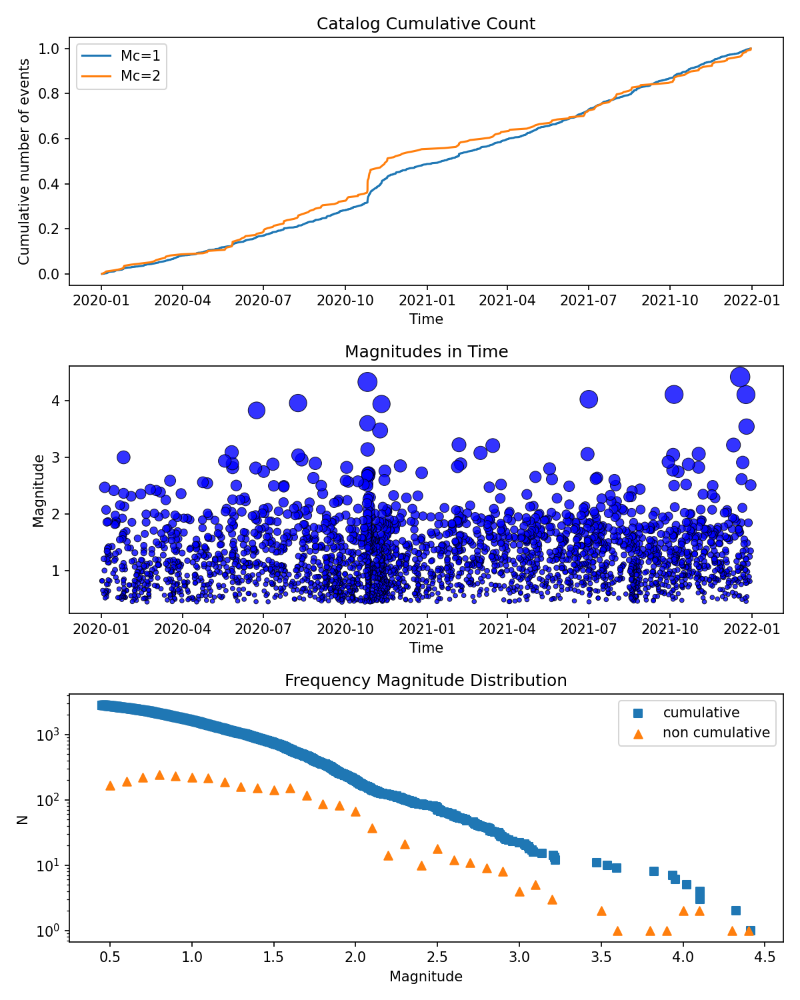

# 10 Minutes to SeismoStats 

Welcome to a quick overview of **SeismoStats** — a Python package which is designed to simplify the analysis of seismic catalogs and to provide a foundation for more advanced seismicity studies.

This overview introduces the core features of SeismoStats, with a focus on three primary analysis goals:

- **b-value** calculation  
- **a-value** estimation  
- **Magnitude of completeness** estimations  

Additionally, we demonstrate how to easily visualize your data and explore key features of your catalog.

---

A central feature of SeismoStats is the `Catalog` object, which offers a quick and flexible way to get started. It is built on top of a `pandas.DataFrame`, meaning all standard pandas methods are available and fully supported.

## 1 Creating a Catalog

Catalogs can be created from:

- `pandas.DataFrame`  
- Python dictionaries
- Existing catalogs in **QuakeML** or **OpenQuake** formats  

You can also fetch earthquake data directly from FDSN servers such as **EIDA** and **USGS** using the built-in FDSN client.

> **Note:** Your catalog must include a `magnitude` column. For full functionality (especially plotting and analysis), it is recommended to also include `time`, `latitude`, `longitude`, and `depth`.


### 1.1 Example: Creating a Catalog from a DataFrame

```python
>>> from seismostats import Catalog
>>> import pandas as pd

>>> # Create a DataFrame with earthquake data
>>> df = pd.DataFrame({
...    'longitude': [42.35, 1.35],
...    'latitude': [7.34444, 5.13500],
...    'depth': [5.50, 10.52],
...    'time': ['2022-01-01 05:05:13', '2022-04-07 07:07:15'],
...    'magnitude': [1.0, 2.5]
... })

>>> # Initialize a Catalog
>>> cat = Catalog(df)

>>> # Preview the first entries
>>> cat.head()
    longitude   latitude    depth   time                magnitude
 0  42.35       7.34444     5.50    2022-01-01 05:05:13 1.0
 1  1.35        5.13500     10.52   2022-04-07 07:07:15 2.5

```


### 1.2 Example: Creating a Catalog from QuakeML
```python
>>> cat = Catalog.from_quakeml(quakefile)

>>> # Preview the first entries
>>> cat.head()
  event_type             time                  latitude  longitude      depth evaluationmode  magnitude magnitude_type  magnitude_MLhc  magnitude_MLv
0  earthquake  2021-12-30 07:43:14.681975   46.051445   7.388025  1181.640625        manual   2.510115           MLhc        2.510115344        2.301758471
1  earthquake  2021-12-25 14:49:40.125942   47.371755   6.917057  3364.257812        manual   3.539687           MLhc        3.539687307               NaN
```


### 1.3 Example: Downloading a catalog from a FDSN-Server
Since downloads are limited to a maximum of 20,000 events, you can use the batch download option for larger datasets. This method downloads the data in subsets of events based on the specified `batch_size`.
```python
>>> from seismostats.catalogs.client import FDSNWSEventClient
>>> from seismostats import Catalog
>>> import pandas as pd

>>> # Define time range and region of interest
>>> start_time = pd.to_datetime('2020/01/01')
>>> end_time = pd.to_datetime('2022/01/01')

>>> min_longitude = 5
>>> max_longitude = 11
>>> min_latitude = 45
>>> max_latitude = 48

>>> min_magnitude = 0.5
>>> url = 'http://eida.ethz.ch/fdsnws/event/1/query'
>>> client = FDSNWSEventClient(url)

>>> # Download events
>>> df = client.get_events(
...     start_time=start_time,
...     end_time=end_time,
...     min_magnitude=min_magnitude,
...     min_longitude=min_longitude,
...     max_longitude=max_longitude,
...     min_latitude=min_latitude,
...     max_latitude=max_latitude,
...     batch_size=1000)

>>> # Create catalog and preview entries
>>> cat = Catalog(df)
>>> cat.head()
  event_type             time                  latitude  longitude      depth evaluationmode  magnitude magnitude_type  magnitude_MLhc  magnitude_MLh
0  earthquake  2021-12-30 07:43:14.681975   46.051445   7.388025  1181.640625        manual   2.510115           MLhc     2.510115344            NaN
1  earthquake  2021-12-30 01:35:37.014056   46.778985   9.476219  9294.921875        manual   1.352086           MLhc     1.352086067            NaN
2  earthquake  2021-12-29 08:48:59.059653   47.779511   7.722354 16307.812500        manual   0.817480           MLhc     0.8174796651           NaN

```

---

## 2 Visualizing the Catalog

The `Catalog` class offers several built-in methods for analyzing and visualizing your seismic data.

These tools allow you to:

- Quickly explore spatial and temporal patterns
- Inspect magnitude distributions
- Generate publication-ready plots with minimal code

Use these methods to gain insights into your catalog before performing more advanced statistical analyses.

```python
>>> # import matplotlib for creating a combined plot
>>> import matplotlib.pyplot as plt

>>> # plot basic information of the catalog
>>> fig, ax = plt.subplots(3, 1, figsize=(8, 10))
>>> ax[0].set_title('Catalog Cumulative Count')
>>> cat.plot_cum_count(ax=ax[0],mcs=[1,2])
>>> ax[1].set_title('Magnitudes in Time')
>>> cat.plot_mags_in_time(ax=ax[1])
>>> ax[2].set_title('Frequency Magnitude Distribution')
>>> cat.plot_cum_fmd(ax=ax[2])
>>> cat.plot_fmd(ax=ax[2])
>>> plt.tight_layout()
>>> plt.show()

>>> # Earthquake map:
>>> fig = plt.figure(figsize=(8, 5))
>>> cat["latitude"]= cat["latitude"]
>>> cat.plot_in_space(include_map=True)
>>> plt.show()
```
<p align="center">

</p>

<p align="center">

</p>

---

## 3 First analysis 
Before performing statistical analysis, it's important to bin the magnitudes in your catalog correctly.  
The choice of bin size should reflect the magnitude resolution of your dataset to ensure accurate results.

Proper binning is essential for calculating meaningful b-values, a-values, and the magnitude of completeness.

By using `inplace=True` in the `bin_magnitudes` method, the magnitudes of the catalog object will be replaced by their binned version:

```python
>>> print(cat.magnitude.head())
0    2.510115
1    1.352086
2    0.817480
3    1.252432
4    0.897306
Name: magnitude, dtype: float64

>>> cat.delta_m = 0.1
>>> cat.bin_magnitudes(inplace=True)
>>> print(cat.magnitude.head())
0    2.5
1    1.4
2    0.8
3    1.3
4    0.9
Name: magnitude, dtype: float64
```

### 3.1 Estimating the Magnitude of Completeness

Seismostats provides three methods to estimate the **magnitude of completeness** ($M_c$) in earthquake catalogs:

- **Maximum Curvature**
- **B-Stability**
- **Kolmogorov-Smirnov (KS) Test**

These methods help assess the quality of your catalog by identifying the lowest magnitude above which events are reliably recorded. More information on the methods can be found in the section {ref}`Magnitude of Completeness<estimat_mc.md>`.

For more a more theoretical background on these methods, refer to the following studies:

- Woessner, J., & Wiemer, S. (2005). *Assessing the quality of earthquake catalogues: Estimating the magnitude of completeness and its uncertainty*. Bulletin of the Seismological Society of America, 95(2), 684–698.
- Clauset, A., Shalizi, C.R. and Newman, M.E., 2009. *Power-law distributions in empirical data*. SIAM review, 51(4), 661-703.

> **Note:** 
> Calling any of the methods below will overwrite the `Catalog.mc` property with the newly estimated magnitude of completeness.

```python
>>> cat.estimate_mc_maxc()
>>> print(cat.mc)
1.0
>>> cat.estimate_mc_b_stability()
>>> print(cat.mc)
1.5
>>> cat.estimate_mc_ks()
>>> print(cat.mc)
2.1
```

### 3.2 Estimating the B-value
The **b-value** in the Gutenberg-Richter law quantifies the relative frequency of large versus small earthquakes in a seismic catalog. 
The most common approach to estimate the b-value is through the **maximum likelihood method**, assuming an exponential distribution of magnitudes. Additional estimation techniques are discussed in the section on {ref}`B-value estimations <estimate_b.md>`.

Before estimating the b-value, make sure that the properties `Catalog.mc`, `Catalog.delta_m` are set. Alternatively, these parameter can be directly provided when calling `estimate_b`:
```python
>>> cat.mc = 1.8
>>> cat.delta_m = 0.1
>>> cat.estimate_b()
>>> print(cat.b_value)
1.064816286818266
>>> cat.estimate_b(delta_m = 0.1, mc=1.8)
>>> print(cat.b_value)
1.064816286818266
```

### 3.3 Estimating the A-value
The **a-value** of the Gutenberg-Richter law  describes the overall earthquake activity in a specific area and time span. It reflects how many events are expected, regardless of their magnitude.

Similar to the b-value estimations, the parameter `Catalog.mc`, `Catalog.delta_m` must be defined beforehand or provided directly as arguments to the a-value estimation method.
```python
>>> cat.estimate_a()
>>> print(cat.a_value)
2.2121876044039577
>>> cat.estimate_a(delta_m = 0.1, mc=1.8)
>>> print(cat.a_value)
```

