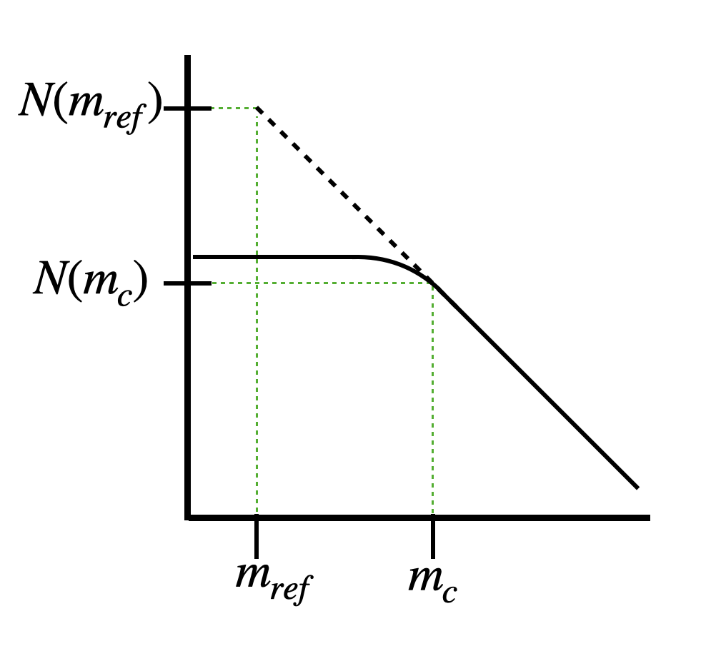

# Estimate a-value
The a-value is the parameter in the Gutenberg-Richter law that contains information on the rate of seismicity within the volume and time interval of interest.

Here, we will
1. Explain the basics of a-value estimation, and 
2. Show the different methods that a-value estimation can be done with SeismoStats.

## 1. Short Introduction on a-value Estimation
The GR law above the completeness magnitude $m_c$ can be expressed as follows:

$$
N(m) = 10^{a - b (m - m_c)},
$$

where $N(m)$ is the number of events with magnitudes larger than or equal to $m$ that occurred in the catalog. With this definition we can estimate the a-value as the logarithm of the number of earthquakes above completeness:

$$
a = \log N(m_c)  \tag{1}
$$

There are, however, two commonly used modifications of the function above, which are relevant if we want to compare different a-values to each other.

### 1.1 Reference Magnitude
First, it might be that the level of completeness is not constant. Therefore, in practice, many instead estimate the a-value with respect to a certain reference magnitude, such that $10^{a_{m_{ref}}} = N(m_{ref})$. Here, $N(m_{ref})$ is not the actual number of earthquakes above $m_{ref}$, but the extrapolated number if the GR law were perfectly valid above and below $m_c$, as shown in Fig. 1 below. The new a-value can now be estimated using the a-value defined in Eq. (1): $a_{m_{ref}} = a - b(m_{ref} - m_c)$.

<figure>
  
  <figcaption>Figure 1: Sketch of the reference magnitude.</figcaption>
</figure>

### 1.2 Scaling
Second, the time intervals that are compared are often not the same, making it hard to compare. In many cases, researchers scale the a-value so that $N(m)$ means the number of earthquakes above $m$ within a year (which is effectively a rate). We include this possibility in the form of a scaling factor. This scaling factor encompasses information about how many time-units fit within the time interval of observation. E.g., if the interval of observation is 10 years but we want to scale the a-value to one year, the scaling factor is 10. Note that the same can be applied for spatial comparison: If we want to compare the number of earthquakes in two different volumes, we might be interested in the number of earthquakes per cubic km. If we have a volume of 100 cubic km, the scaling factor is therefore 100.

### 1.3 Positive Methods
Finally, similarly to the b-value estimation, we have implemented "positive" a-value estimation methods. These are built on the implicit assumption that the momentary completeness is given by the magnitude of the last detected earthquake (plus a buffer, called $\delta m_c$). We based our definitions on the article by Van der Elst and Page, 2023, with the difference that we homogenized the naming convention with the b-value methods:

- "positive" means that only earthquakes that are larger than the previous one are taken into account.
- "more positive" means that for each earthquake, the next larger one in the catalog is used for the rate estimation. (this is the method is described by Van der Elst and Page, 2023, but the naming convention is taken from Lipiello and Petrillo, 2024)

For both methods, the main idea is to estimate the share of the time that is covered by the used events in order to estimate the a-value. For the positive method, this is quite straight forward: for each positive difference $m_{i+1} - m_i > \delta m_c$, the time difference can be taken as $\Delta t = t_{i+1} - t_i$. Then, the a-value can be estimated as:

$$
a^+ = \log n^+ - \log \frac{\sum_{i=1}^{n^+} \Delta t_i}{T},
$$

where $n^+$ is the number of positive differences in the catalog, and $T$ is the entire interval of observation. The result of this computation can be directly compared with the classical a-value.

For the more-positive method (as desccribed in  Van der Elst and Page, 2023), we take instead the time to the next larger event, and then scale it according to the GR-law (this means that the b-value will be needed for this estimation). The scaled times can be estiamted as $\tau_i = \Delta t_i 10^{-b(m_i + \delta m_c)}$. Here, $m_i$ is the magnitude of the first earthquake. Finally, we have to include the open intervalls, $T_j = (T-t_j)  10^{-b(m_i + \delta m_c)}$ in order to prevent the a-value estimate to be biased. Finally, the a-value estimate is as follows:

$$
a^+ = \log n^{++} - \log \frac{\sum_{i=1}^{n^{++}} \Delta 
\tau_i + \sum_{j=1}^{m}T_j}{T},
$$

where $n^{++}$ is the number of closed intervals, and $m$ is the number of open intervals (i.e., events after which no larger magnitude occurs within the catalog), and $n^{++} + m$ is the total number of events above the completeness. Note that this equation is the same as put forward by Van der Elst and Page, 2023, with the only exeption that we included the total time $T$. This detail has the effect that the classical a-value estimator and the more-positive a-value estimator have the same expectation value and can therefore be directly compared.

## 2. Estimation of the a-value
In SeismoStats, we provide several ways to estimate the a-value:
- Use the {ref}`AValueEstimator <reference/analysis/avalues:Estimators>` class
- Use the function {func}`estimate_a <seismostats.analysis.estimate_a>` (this is the easiest way, [jump there](estimate-a))
- Use the method {func}`estimate_a <seismostats.Catalog.estimate_a>` native to the Catalog class (most practical if the catalog format is used [jump there](cat-estimate-a))

Below, we show examples for each method.

### 2.1 AValueEstimator
The basis of all a-value estimations in SeismoStats is the `AValueEstimator`. The AValueEstimator class defines how a-value estimation works in general: the input is at least the magnitudes, the magnitude of completeness, and the magnitude discretization. This class is then used to implement a specific method of a-value estimation. The three methods implemented for now are described above and are called `ClassicAValueEstimator`, `APositiveAValueEstimator`, and `AMorePositiveAValueEstimator`. These classes function in a very similar way to the b-value estimators described in {doc}`estimate b <estimate_b>`.

The class can be used as follows:

```python
>>> from seismostats.analysis import ClassicAValueEstimator
>>> estimator = ClassicAValueEstimator()
>>> estimator.calculate(mags, mc, delta_m)
3
>>> estimator.a_value
3
```

In the example above, `mags` is a vector of magnitudes with 1000 values above $m_c$. Note that the estimator automatically cuts off magnitudes below $m_c$ and does not count them. This is true for all a-value estimations. Therefore, it is of crucial importance to provide the correct $m_c$. The reason that $\Delta m$ is needed here is only to correctly cut off at $m_c$. The estimated a-value is finally stored within the instance of the class, which we called `estimator` in our example.

`APositiveAValueEstimator` works in a similar way. However, they have the additional arguments `dmc` (see $\delta m_c$ above) and `time`. If `dmc` is not given, it is set to $\Delta m$. `times`, on the other hand, has to be provided, as it plays an important role to estimate a (as described in the section above).

```python
>>> from seismostats.analysis import APositiveAValueEstimator
>>> estimator = APositiveAValueEstimator()
>>> estimator.calculate(mags, mc, delta_m, times, dmc=dmc)
3.001
>>> estimator.a_value
3.001
```

Finally, `AMorePositiveAValueEstimator` requires one more additional argument: the b-value. This is because the time differences have to be scaled using the GR-law. 

```python
>>> from seismostats.analysis import AMorePositiveAValueEstimator
>>> estimator = AMorePositiveAValueEstimator()
>>> estimator.calculate(mags, mc, delta_m, times, b_value=1)
2.980
>>> estimator.a_value
2.980
```

Note that for `APositiveAValueEstimator` and `AMorePositiveAValueEstimator`, the parameter `mc` still is used as in the classical case: magnitudes below will be disregarded.

### 2.2 estimate_a
In order to estimate the a-value with Eq. (1), one needs only to know the magnitude of completeness and the discretization of the magnitudes, $\Delta m$.

```python
>>> from seismostats.analysis import estimate_a
>>> magnitudes = [0, 0, 1, 1, 1, 2, 3, 2, 3, 5, 6, 7]
>>> estimate_a(magnitudes, mc=1, delta_m=1)
1.0
```

Note that the function `estimate_a` automatically cuts off magnitudes below $m_c$ and does not count them. Therefore, it is of crucial importance to provide the correct $m_c$. The reason that $\Delta m$ is needed here is only to correctly cut off at $m_c$.

The default method for the a-value estimation is the classical method (Eq. 1). However, it is also possible to specify which method should be used. This can be done as follows:
```python
>>> from seismostats.analysis import estimate_a, APositiveAValueEstimator
>>> times = numpy.arange(10)
>>> estimate_a(magnitudes, mc=1, delta_m=1, method=APositiveAValueEstimator)
0.954
```

### 2.3 cat.estimate_a()
When you have already transformed your data into a Catalog object, you can directly use the internal method of the Catalog class, which works exactly in the same way as the function shown above.

```python
>>> cat.estimate_a(mc=1, delta_m=0.1)
2.345
```

Note that, if $\Delta m$ and $m_c$ are already defined in the catalog, the method will use these values to estimate the a-value:

```python
>>> cat.mc = 1
>>> cat.delta_m = 0.1
>>> cat.estimate_a()
2.345
```

This is especially practical since these attributes are set by the the binning method and the estimate_mc methods. 
```python
>>> # First, estimate mc
>>>cat.estimate_mc_max()
>>> # Now, it is set as an attibute 
>>> cat.mc
1.0
>>> # Second, bin the magnitudes
>>> cat.bin_magnitudes(delta_m=0.1, inplace=True)
>>> cat.delta_m
0.1
>>> cat.estimate_a()
2.345
```

## References
- Van der Elst, Nicholas J., and Morgan T. Page. "a‐positive: A robust estimator of the earthquake rate in incomplete or saturated catalogs." *Journal of Geophysical Research: Solid Earth* 128.10 (2023): e2023JB027089.
- Lippiello, E., and G. Petrillo. "b‐more‐incomplete and b‐more‐positive: Insights on a robust estimator of magnitude distribution." Journal of Geophysical Research: Solid Earth 129.2 (2024): e2023JB027849.