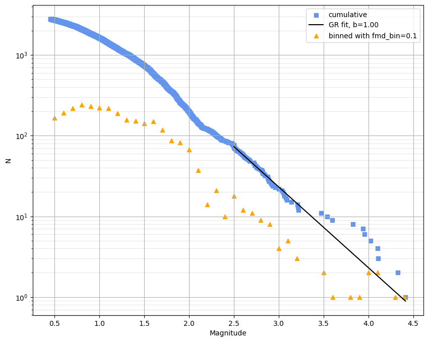
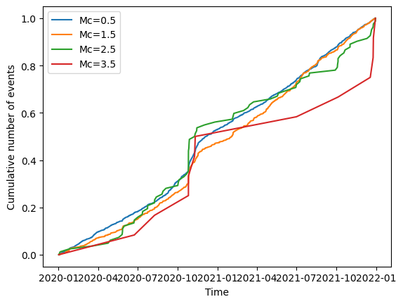
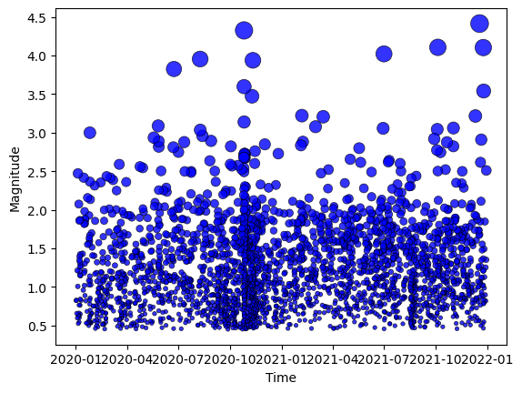
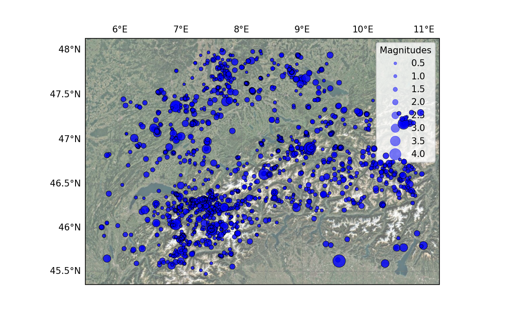

# Plotting

Earthquake catalogs normally contain information about location, time, and magnitude of events. Here, we demonstrate the functions available in SeismoStats for visualising these properties. We group the visualisation tools into three categories: **magnitude distributions**, **temporal visualisations**, and **spatial visualisations**. All the functions take the magnitudes, locations, and times as arguments, but are also available as methods of the `Catalog` object, in which case these are not specified, but taken from the catalog directly.

## 1. Magnitude Distribution

Observing the magnitude distribution of earthquakes is a cornerstone of most analyses, showing the relationship between the size of earthuakes and their numerousness. Plotting this relationship allows us to roughly visually assess the completeness of our catalog and get an idea about its b-value, as well as compare whether a b-value estimate fits our data well. 

### 1.1 Frequency-magnitude distribution (FMD)


FMD is a histogram-style plot that shows the number of earthquakes per magnitude bin. In SeismoStats, it can be created using:

```python
>>> from seismostats.plots import plot_fmd
>>> plot_fmd(magnitudes, fmd_bin=0.1)

# Also works as a catalog class method:
>>> cat.plot_fmd(fmd_bin=0.1)
```

Key arguments are the list of magnitudes and width of magnitude bins. The width of the magnitude bins best for visualisation purposes is not necessarily the one corresponding to the catalog binning. If used as a catalog method, the function will not assume the catalog binning `delta_m` as the default `fmd_bin`. Optional arguments include plotting options such as `bin_position`, `color`, `size`, `legend`.

### 1.2 Cumulative frequency-magnitude distribution
The cumulative FMD shows the total number of events with magnitudes equal to or greater than a given value. This representation is log-linear and fits naturally with the Gutenberg-Richter law.

```python
>>> from seismostats.plots import plot_cum_fmd
>>> plot_cum_fmd(magnitudes, delta_m=0.1, b_value=1.0, mc=2.5)
```

The function also works as a catalog class method, and assumes `delta_m`, `b_value`, `mc` if they are not given as arguments and exist as catalog attributes.

```python
>>> cat.plot_cum_fmd(delta_m=0.1, b_value=1.0, mc=2.5)

# Same as:
>>> cat.b_value = 1.0
>>> cat.mc = 2.5
>>> cat.delta_m = 0.1
>>> cat.plot_cum_fmd()
```

If `b_value` and `mc` are provided, the function overlays the theoretical Gutenberg-Richter line. Different colors can be used for data vs. fit. Output is log-scaled on the y-axis.


<figure>
  
  <figcaption>Figure 1: plot_fmd and plot_cum_fmd.</figcaption>
</figure>

## 2. Seismicity through time

SeismoStats supports time-based plotting, which is essential for detecting changes in event frequency helping us observe temporal clustering, and detecting completeness magnitude changes.

### 2.1 Cumulative count of events through time

This plot shows the cumulative count of events on the y-axis with the progress of time shown on the x-axis. Sudden jumps reveal temporal clustering, expected after the occurrence of large events. Changes in slope of the count, however, indicate possible changes in completeness magnitude. Required arguments are array-like structures of times and magnitudes. If `mcs` (array-like) is given, multiple lines are plotted, each element serving as a cut-off magnitude for the corresponding line. In that case, it is also recommended to provide a `delta_m`, in order to filter the magnitudes correctly -- if it is not provided, cut-off is done exactly at the cut-off values given in `mcs`. If the Catalog method is used, `delta_m` is taken from the object attribute if it exists and is not specified by an argument.
 
```python
>>> from seismostats.plots import plot_cum_count
>>> plot_cum_count(times, magnitudes, mcs=np.arange(0.5, 4.0, 1), delta_m=0.1)
``` 

Also works as a catalog class method:
``` python
>>> cat.plot_cum_count(mcs=np.arange(0.5, 4.0, 1), delta_m=0.1)
```

<figure>
  
  <figcaption>Figure 2: plot_cum_count.</figcaption>
</figure>

### 2.2 Magnitudes in time

Function {func}`plot_mags_in_time <seismostats.plots.plot_mags_in_time>` visualises seismicity through time by showing magnitude on the y-axis, and time on the x-axis. Size of the dots in this scatter plot reflect the magnitudes of events. As before, `times` and `magnitudes` are mandatory. If the completeness magnitude changes in time, this information can be added to the plot by specified a list of `mc_change_times` and `mcs`, where completeness magnitude on a given position in `mcs` is valid starting from the time at that same position in `mc_change_times`. The times can be given as datetime objects, or integers (assumed years).

```python
>>> from seismostats.plots import plot_mags_in_time
>>> plot_mags_in_time(times, magnitudes)
```

Also works as a catalog class method:
``` python
>>> cat.plot_mags_in_time()
```

<figure>
  
  <figcaption>Figure 3: plot_mags_in_time.</figcaption>
</figure>

## 3. Seismicity in space

The {func}`plot_in_space <seismostats.plots.plot_in_space>` function allows you to visualize seismicity in geographic space, with optional background maps and customizable styling. The key capabilities are:

* Scaling of dot sizes by magnitude
* Optionally include a background map
* Focus on a specific country or bounding box
* Customizable colors, labels, and interpolation for dot sizes

```python
>>> from seismostats.plots import plot_in_space
>>> plot_in_space(longitudes, latitudes, magnitudes)
```

Also works as a catalog class method, and with some additional arguments:
``` python
>>> cat.plot_in_space(
... resolution='10m', include_map=True,
... country='Switzerland',
... colors='Greys_r',
... dot_labels=[1,2,3])
```

<figure>
  
  <figcaption>Figure 4: plot_in_space.</figcaption>
</figure>


